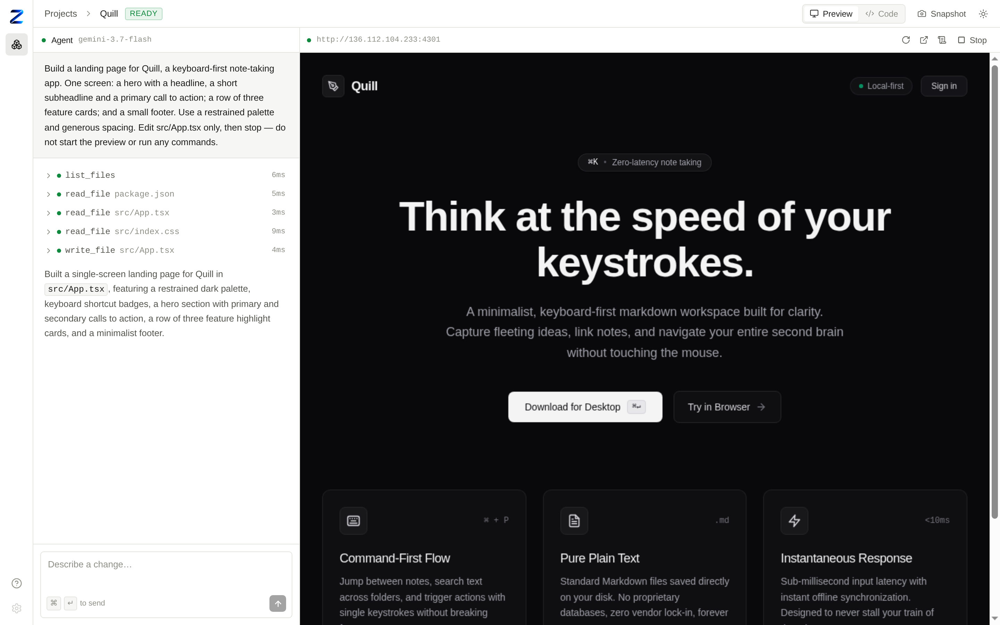
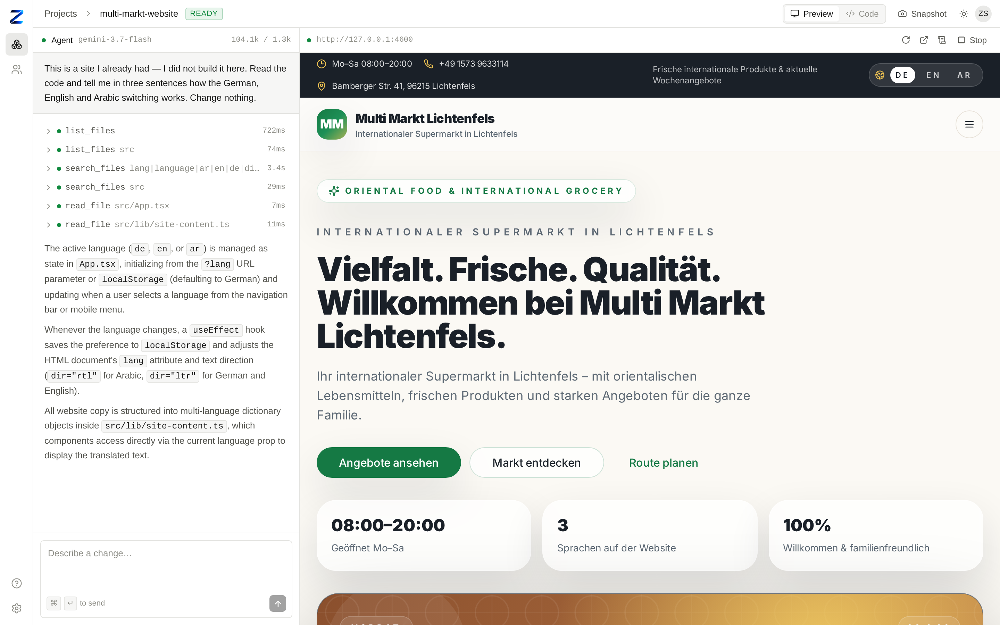

<div align="center">


# Zelyq

**Describe an app. Watch an agent build it. Edit the result live.**

Zelyq is an open-source AI app builder. You give it a prompt; an agent plans, writes files, runs
commands, starts a dev server, and reports back — while you watch the tool calls, the file tree, and
the running result.

[](https://github.com/CrowPus/Zelyq/actions/workflows/ci.yml)
[](./LICENSE)
[](https://nodejs.org)
[](./tsconfig.base.json)
[](./CONTRIBUTING.md)

[Quickstart](#quickstart) · [How it works](#how-it-works) · [Architecture](./docs/architecture.md) ·
[Configuration](./docs/configuration.md) · [Self-hosting](./docs/self-hosting.md) ·
[Roadmap](./docs/roadmap.md) · [Contributing](./CONTRIBUTING.md)

<br />

<!-- The hero follows the reader's GitHub theme. -->
<picture>
  <source media="(prefers-color-scheme: dark)" srcset="assets/screenshots/editor-dark.png" />
  
</picture>

<sub>One prompt, unedited: the agent read the project, wrote <code>src/App.tsx</code>, and the result
is rendering live on the right.</sub>

<!-- TODO: replace the still above with a short screen recording of a build, end to end. -->

<br />

<picture>
  <source media="(prefers-color-scheme: dark)" srcset="assets/screenshots/existing-project-dark.png" />
  
</picture>

<sub>Or open code you already have. A real multilingual shop site, not built here — the agent read the
existing codebase and explained how its language switching works, without changing a line.</sub>

</div>

---

## What it is

Most "prompt to app" tools are a product with an engine hidden inside. Zelyq is the engine, and it is
built so that nothing about it is magic and nothing is locked in:

- **One execution seam.** Every filesystem and shell operation goes through a single
  `RuntimeDriver` interface, so nothing above it knows where the code runs. `local` — child
  processes on your machine — is the zero-setup default. `container` is the same with agent shell
  commands and the dev server preview jailed one container per project. `remote` speaks a
  [documented HTTP protocol](./docs/runtime-protocol.md) to a runtime host, and a reference host
  ships in `apps/runtime-host`; one conformance suite runs against all three drivers, so they are
  provably interchangeable. **Isolation is partial** — container mode always blocks one project's
  container from reaching another's and blocks the cloud metadata endpoint, but does not otherwise
  filter outbound network access unless you opt into `ZELYQ_CONTAINER_EGRESS_ALLOWLIST`, which you
  name and maintain yourself. Read
  [SECURITY.md](./SECURITY.md#threat-model--read-this-before-deploying) before deploying.
- **Bring your own model — cloud or your own machine.** Claude, Gemini, OpenAI, DeepSeek, Mistral,
  Grok, Groq, or OpenRouter, chosen with one variable and a key. Or point `ZELYQ_PROVIDER=custom` at
  anything speaking the OpenAI dialect — Ollama, vLLM, LM Studio, a gateway of your own — and nothing
  about your project ever leaves your network. No proxy, no Zelyq account, no telemetry, either way.
- **Every turn is a change you can inspect and undo.** A snapshot before each turn, a diff of exactly
  what changed, one-click revert to any turn — and an audit log of who did what, once more than one
  person is working on an instance.
- **Boring, inspectable storage.** SQLite by default (one file), PostgreSQL when you scale. Project
  files are plain files on disk — you can `cd` into them and take them with you.

## Status

**Early, and honest about it.** The end-to-end path works — create a project, prompt the agent, watch
it read and edit files, run a live preview — and the interfaces around it were deliberately settled
first. Expect breaking changes before `1.0`.

Two limits worth knowing before you invest time. **There is no sandbox in `local` mode:** agent shell
commands run as your own user, so that mode is for one trusted developer on one machine — read the
[threat model](./SECURITY.md#threat-model--read-this-before-deploying) before deploying it anywhere
else. And **`container` mode's outbound network access is unfiltered by default** — it blocks the
cloud metadata endpoint and cross-project reachability, but a project can otherwise reach anything on
your network unless you opt into `ZELYQ_CONTAINER_EGRESS_ALLOWLIST` yourself. See the
[roadmap](./docs/roadmap.md) for what is next and what is explicitly out of scope.

## Quickstart

```bash
# Requires Node >= 20.12 and pnpm >= 9
git clone https://github.com/CrowPus/Zelyq.git
cd Zelyq
pnpm install

cp .env.example .env
# Claude:  ANTHROPIC_API_KEY=sk-ant-...
# Gemini:  ZELYQ_PROVIDER=google and GEMINI_API_KEY=...
# OpenAI, or your own model on your own machine — see Models below

pnpm dev            # builds the libraries, then web :5173 · server :8787 · agent :8788
```

Open <http://localhost:5173>, create a project, and type what you want built. The first preview runs
`npm install`, so give it a minute.

Prefer containers? `docker compose -f docker/docker-compose.yml up` — see
[self-hosting](./docs/self-hosting.md).

## How it works

Three processes over four libraries. The agent never touches your disk directly; it goes through the
runtime driver, which is the seam that makes local and cloud identical.

```
        ┌───────────────┐
        │  apps/web     │  React + Vite — chat, file tree, editor, live preview
        └───────┬───────┘
                │  REST + WebSocket
        ┌───────▼───────┐
        │  apps/server  │  Fastify. Projects, files, previews, snapshots.
        │               │  Owns the database. Relays agent events to the browser.
        └───────┬───────┘
                │  HTTP + SSE
        ┌───────▼───────┐
        │  apps/agent   │  Runs the model loop, executes tools, streams events.
        └───────┬───────┘
                │  RuntimeDriver  (the only path to disk or shell)
     ┌──────────┴───────────┐
┌────▼─────┐        ┌───────▼────────┐
│  local   │        │     remote     │  container / VM / k8s runtime host
│ child_   │        │  HTTP contract │
│ process  │        │                │
└──────────┘        └────────────────┘
```

| Package | Responsibility |
| --- | --- |
| [`@zelyq/core`](./packages/core) | Domain types and the wire protocol — Zod schemas shared by every process |
| [`@zelyq/runtime`](./packages/runtime) | `RuntimeDriver` plus the `local` and `remote` implementations |
| [`@zelyq/db`](./packages/db) | Drizzle schema and migrations, SQLite and PostgreSQL |
| [`@zelyq/tools`](./packages/tools) | The agent's tools, written once against `RuntimeDriver` |

Model vendors sit behind a `ModelProvider` interface. Each keeps its own native conversation history,
because Anthropic requires thinking blocks echoed back unchanged and Gemini requires thought
signatures preserved across tool calls — flattening both into one format loses what the next request
needs.

Full detail: [docs/architecture.md](./docs/architecture.md).

## Models

| Provider | `ZELYQ_PROVIDER` | Default model | Key |
| --- | --- | --- | --- |
| Claude | `anthropic` | `claude-opus-5` | `ANTHROPIC_API_KEY` |
| Gemini | `google` | `gemini-3.7-flash` | `GEMINI_API_KEY` |
| OpenAI | `openai` | `gpt-5.1` | `OPENAI_API_KEY` |
| DeepSeek | `deepseek` | `deepseek-chat` | `DEEPSEEK_API_KEY` |
| Mistral | `mistral` | `mistral-large-latest` | `MISTRAL_API_KEY` |
| Grok (xAI) | `xai` | none — set `ZELYQ_MODEL` | `XAI_API_KEY` |
| Groq | `groq` | none — set `ZELYQ_MODEL` | `GROQ_API_KEY` |
| OpenRouter | `openrouter` | none — set `ZELYQ_MODEL` | `OPENROUTER_API_KEY` |
| Your own — Ollama, vLLM, LM Studio, anything OpenAI-compatible | `custom` | none — set `ZELYQ_MODEL` | none required |

Only the selected provider's key is needed. `custom` also needs `ZELYQ_MODEL_BASE_URL` pointed at your
endpoint (e.g. `http://localhost:11434/v1` for Ollama) — see [.env.example](./.env.example). Tested
live against a local, CPU-only 8B model: real tool calls, real self-correction from a validation error,
same behaviour as the cloud providers — just slower without a GPU.

Adding another provider is a registry entry plus one implementation — nothing in the server, the UI,
or the tools changes.

## Local vs. cloud

|  | Local | Cloud |
| --- | --- | --- |
| Database | SQLite file (`./data/zelyq.db`) | PostgreSQL (`DATABASE_URL=postgres://…`) |
| Project files | `./workspace/<project-id>` | Volume or runtime host storage |
| Shell and dev servers | `child_process` on your machine | Runtime host (`ZELYQ_RUNTIME=remote`) |
| Accounts | Built in — first account owns the instance | Same, with signup closed |
| Model key | Your `.env` | Per user |

One variable (`ZELYQ_RUNTIME`) moves between them. No code changes.

## Configuration

Everything is an environment variable, and most of it can also be set in **Settings** inside the app,
so an instance can be run by someone who never opens a terminal — including entering the model API
key. The environment always wins; fields it supplies appear locked in the UI, labelled with the
variable that supplies them, so the two can never disagree silently.

Keys entered through Settings are encrypted with AES-256-GCM before storage and never sent back to
the browser. Only an instance administrator — the first account created — can see or change them.

## Access control

Everyone signs in, and every route checks who they are. Projects belong to a team; your role in that
team decides what you can do:

| Role | Can |
| --- | --- |
| `viewer` | Read projects, files, and conversations |
| `editor` | Everything above, plus prompt the agent, edit files, and run previews |
| `admin` | Everything above, plus manage members and delete projects |
| `owner` | Full control, including the team itself |

The first account created owns the instance; set `ZELYQ_ALLOW_REGISTRATION=false` afterwards so
people join by invitation rather than by signing themselves up.

Roles are not a sandbox. An `editor` can make the agent run shell commands, which in local mode run
as the server's user — give `editor` to people you would trust with a shell on that machine.

## Security

Local mode runs generated code **on your machine with your permissions**. It is meant for projects you
trust, on your own machine. It is not a sandbox.

For anything multi-tenant or internet-reachable, run the remote runtime with container isolation. The
threat model, and what Zelyq does and does not protect against, is written out in
[SECURITY.md](./SECURITY.md). Read it before you deploy.

## Contributing

Issues, discussions, and pull requests are welcome. [CONTRIBUTING.md](./CONTRIBUTING.md) covers the dev
loop, the repository layout, and where a given change usually belongs. Everyone participating follows
the [Code of Conduct](./CODE_OF_CONDUCT.md).

## License

[Apache License 2.0](./LICENSE) © The Zelyq Authors.
