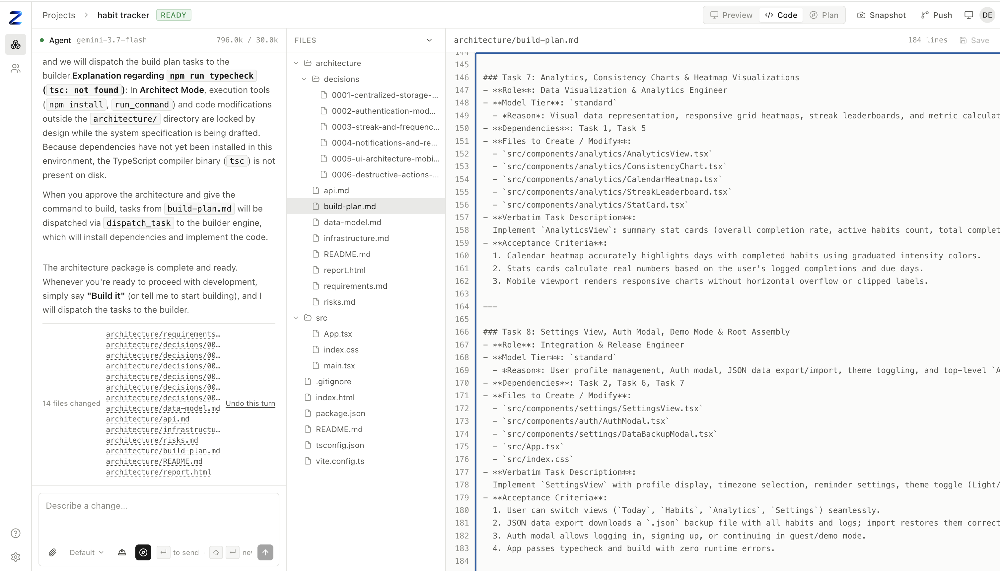
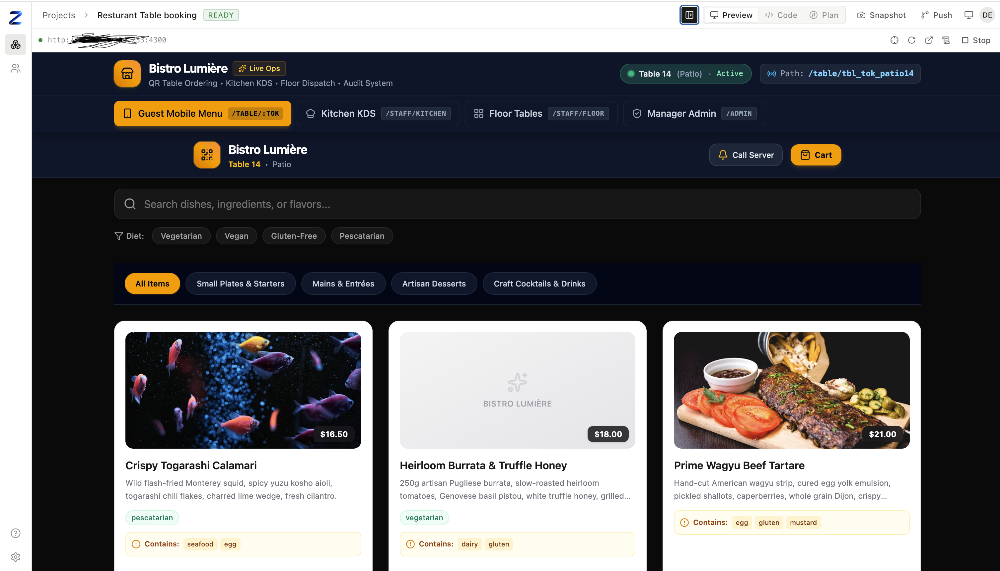
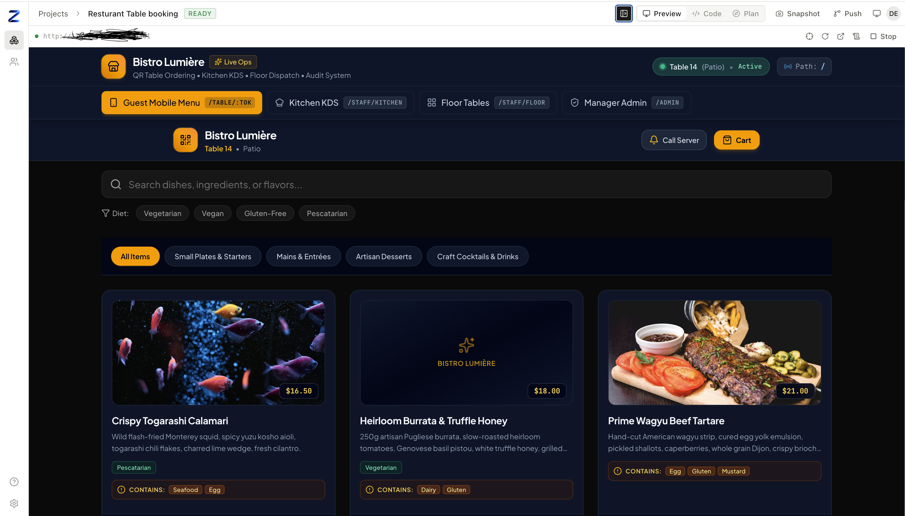

<div align="center">


# Zelyq

**Vibecoding writes code. Zelyq builds like an engineer.**

### [Try it live → zelyq.com](https://zelyq.com)

<video src="https://github.com/user-attachments/assets/3debd0aa-6858-4017-a40f-feb6f293b9ef" autoplay loop muted playsinline controls width="900"></video>

<sub>▶ Watch it happen — one prompt in, and the agent built a working commerce admin: analytics, a discount engine, a live theme customizer, multi-currency and tax settings, and an encrypted checkout simulation, with its own typecheck and preview passing before it called the turn done.</sub>

<br />

<video src="https://github.com/user-attachments/assets/1cba3b43-4be1-4940-83dd-0465017ba502" controls muted loop playsinline width="900"></video>

<sub>▶ And the agent connecting a Supabase backend and building a working AI agent, with the provider key in the backend.</sub>

<br />

<video src="https://github.com/user-attachments/assets/11e110aa-be4b-4e34-be07-a7c820ce8a81" controls muted loop playsinline width="900"></video>

<sub>▶ And the <b>Cinematic engineer</b> turning a supplied clip into a scroll-scrubbed hero.</sub>

<br />

<video src="https://github.com/user-attachments/assets/a59cd007-fe2f-4396-98c6-b9aaf27345e5" controls muted loop playsinline width="900"></video>

<sub>▶ And checking the build at real mobile, tablet, and desktop widths right in the preview — no resizing the window.</sub>

<br />

<video src="https://github.com/user-attachments/assets/b2782b9e-d020-4a09-99e8-1e96e52ac9af" controls muted loop playsinline width="900"></video>

<sub>▶ And building a <b>real mobile app</b> — pick <b>Expo — React Native</b> when you create a project and the agent builds native screens (<code>View</code> / <code>Text</code> / Expo Router, not <code>div</code>), previewed in the browser via Expo web.</sub>

Most "prompt to app" tools generate something that looks right and leave you to find out where it
isn't. Zelyq's agent plans before it acts, verifies its own work before it calls a turn finished,
tells you plainly what it checked versus what it assumed, and stops to ask instead of guessing when
a request is too vague to build responsibly. It writes files, runs commands, starts a dev server,
and reports back — while you watch every tool call, every file it touched, and the running result,
live.

[](https://github.com/CrowPus/Zelyq/actions/workflows/ci.yml)
[](./LICENSE)
[](https://nodejs.org)
[](./tsconfig.base.json)
[](./CONTRIBUTING.md)

[Live demo](https://zelyq.com) · [Why an engineer](#it-behaves-like-an-engineer-not-a-generator) · [Quickstart](#quickstart) ·
[How it works](#how-it-works) · [Modes](./docs/modes.md) · [Architecture](./docs/architecture.md) ·
[Configuration](./docs/configuration.md) · [Self-hosting](./docs/self-hosting.md) ·
[Roadmap](./docs/roadmap.md) · [Contributing](./CONTRIBUTING.md)

</div>

---

## It behaves like an engineer, not a generator

A code generator's job ends when something compiles. An engineer's job includes knowing what they
actually built, whether it works, and when they don't have enough information to keep going
responsibly. Zelyq's agent is built toward the second one:

- **It verifies before it calls anything done.** The moment the model stops asking for tools, Zelyq
  runs the project's own typecheck (or build) and checks the live preview for a crash — automatically,
  not because the prompt asked nicely. A turn that broke something gets handed back to fix, not
  reported as finished.
- **It says what it knows versus what it guessed.** Turn on **Engineer Mode** and every turn that
  changes something states its purpose up front, then separates what it verified (ran, read, tested)
  from what it inferred and what it assumed — instead of one confident-sounding paragraph that blurs
  the three together.
- **It names the alternative it didn't pick.** When a real choice existed — an architecture, a
  library, a tradeoff with no obviously-better answer — Engineer Mode has it say what it didn't choose
  and why, in a sentence or two, not silently.
- **It plans before it builds, when the ask is big enough to need one.** **Architect Mode** turns a
  vague request into a real design package first — requirements, decisions with the alternative named
  and why it lost, a data model and API, a `DESIGN.md` design system, a build plan broken into
  review-sized tasks — and waits for you to say "build it" before writing any code. Then it
  dispatches each task to a bounded builder, has a separate session verify the running app, and
  claims "done" only against a checklist it can show you. Turn on **Auto Mode** and it runs the
  passes itself, to a hard ceiling, instead of you typing "keep going".
- **It has specialists.** After a build verifies, named agents finish the job — each owns a spec
  file it surveys, writes, and implements, and each streams into the chat as a labelled sub-thread.
  The **Designer** (`DESIGN.md` — a coherent design system, no generic-AI look), the **DevOps
  agent** (`OPERATIONS.md` — CI, a Dockerfile, `.env.example`, deploy config), the **Security/QA
  agent** (`QA.md` — writes and runs the test suite, runs the security scan), and the **Cinematic
  engineer** (`CINEMATIC.md` — turns one screen into a scroll-driven film: a hero that scrubs your
  footage frame by frame as you scroll, a pinned reveal, a horizontal story, built to a
  senior-engineer skill). In Engineer Mode you call any of them yourself: *"make it look
  professionally designed"*, *"set up CI"*, *"write tests"*, *"make the hero play as I scroll"*.
  See [docs/modes.md](./docs/modes.md).
- **A specialist can pause for something only you have.** A cinematic hero *is* the footage, so the
  Cinematic engineer doesn't fake it against a placeholder: it writes a plain-language brief of
  exactly what to provide, creates the folder, and stops. You drop the file in and reply `go` — it
  validates what you gave it against the brief and takes it from there. A dispatched pass that asks,
  waits, and resumes from a plan it already wrote.
- **It builds the backend, not just the screen.** When a project needs saved data or accounts, the
  agent designs a Supabase Postgres schema with Row-Level-Security written per operation, applies the
  migration, wires the client, and has a separate session verify that a second user genuinely can't
  read the first user's rows. AI features too — a chatbot, an extractor, a classifier — with the
  provider key living in the backend, never shipped to the browser.
- **It builds what was asked, then stops.** No invented navbars, no sample-data toggles nobody
  requested, no filling a vague ask with guesses. A request too shapeless to build responsibly gets one
  clarifying question instead of eight files you didn't want.
- **It reaches for expert practice only when a task needs it.** A catalog of packaged, senior-level
  skills — frontend engineering, UI/UX design, application security, CI/CD — loads into a turn only
  when its description actually matches, so the agent isn't running a security review on a landing
  page or a deployment checklist on a button.
- **It stops and asks instead of guessing on anything irreversible.** Deleting data, an action with no
  undo, a request that's really a conversation ("I want to test you," "how would you build X") rather
  than a spec — Engineer Mode treats these as a reason to ask, not a reason to improvise.

None of this is a black box promise — every mechanism above is real code, not marketing copy: the
verification gate and Engineer Mode both live in [`apps/agent/src/session.ts`](./apps/agent/src/session.ts)
and [`apps/agent/src/prompt.ts`](./apps/agent/src/prompt.ts), and [docs/agent-behaviour.md](./docs/agent-behaviour.md)
documents exactly how the turn loop decides what to do.

<div align="center">
<br />



<sub>Architect Mode on a real request: a full design package, reviewable before any code exists —
not just this one file, the whole <code>architecture/</code> package on the left.</sub>

<br /><br />

<table>
<tr>
<td width="50%"></td>
<td width="50%"></td>
</tr>
<tr>
<td align="center"><sub><b>Before</b> — the build, verified and running. Same restaurant system: guest ordering,
a kitchen display, floor dispatch, and manager admin, with real allergen and dietary data.</sub></td>
<td align="center"><sub><b>After</b> — the <b>Designer agent</b> wrote <code>DESIGN.md</code> and applied it:
one dark surface system, the accent colour carried through, real elevation, tighter type. Same content, no
functional change.</sub></td>
</tr>
</table>

</div>

## What it is

Most "prompt to app" tools are a product with an engine hidden inside. Zelyq is the engine, and it is
built so that nothing about it is magic and nothing is locked in:

- **One execution seam.** Every filesystem and shell operation goes through a single
  `RuntimeDriver` interface, so nothing above it knows where the code runs. `local` — child
  processes on your machine — is the zero-setup default. `container` is the same with agent shell
  commands and the dev server preview jailed one container per project. `remote` speaks a
  [documented HTTP protocol](./docs/runtime-protocol.md) to a runtime host, and a reference host
  ships in `apps/runtime-host`; one conformance suite runs against all three drivers, so they are
  provably interchangeable. **Isolation is partial** — container mode always blocks one project's
  container from reaching another's and blocks the cloud metadata endpoint, but does not otherwise
  filter outbound network access unless you opt into `ZELYQ_CONTAINER_EGRESS_ALLOWLIST`, which you
  name and maintain yourself. Read
  [SECURITY.md](./SECURITY.md#threat-model--read-this-before-deploying) before deploying.
- **Bring your own model — cloud or your own machine.** Claude, Gemini, OpenAI, DeepSeek, Mistral,
  Grok, Groq, or OpenRouter, chosen with one variable and a key. Or point `ZELYQ_PROVIDER=custom` at
  anything speaking the OpenAI dialect — Ollama, vLLM, LM Studio, a gateway of your own — and nothing
  about your project ever leaves your network. No proxy, no Zelyq account, no telemetry, either way.
- **Every turn is a change you can inspect and undo.** A snapshot before each turn, a diff of exactly
  what changed, one-click revert to any turn — and an audit log of who did what, once more than one
  person is working on an instance.
- **Boring, inspectable storage.** SQLite by default (one file), PostgreSQL when you scale. Project
  files are plain files on disk — you can `cd` into them and take them with you.
- **Web or mobile.** Pick **React + Vite** or **Expo — React Native** when you create a project.
  The Expo stack previews in the browser via Expo web, and the agent knows it's React Native —
  it builds `View`/`Text`/Expo Router, not `div`. Device and store builds are a separate step.

## Status

**Early, and honest about it.** The end-to-end path works — create a project, prompt the agent, watch
it read and edit files, run a live preview — and the interfaces around it were deliberately settled
first. Expect breaking changes before `1.0`.

Two limits worth knowing before you invest time. **There is no sandbox in `local` mode:** agent shell
commands run as your own user, so that mode is for one trusted developer on one machine — read the
[threat model](./SECURITY.md#threat-model--read-this-before-deploying) before deploying it anywhere
else. And **`container` mode's outbound network access is unfiltered by default** — it blocks the
cloud metadata endpoint and cross-project reachability, but a project can otherwise reach anything on
your network unless you opt into `ZELYQ_CONTAINER_EGRESS_ALLOWLIST` yourself. See the
[roadmap](./docs/roadmap.md) for what is next and what is explicitly out of scope.

## Quickstart

```bash
# Requires Node >= 20.12 and pnpm >= 9
git clone https://github.com/CrowPus/Zelyq.git
cd Zelyq
pnpm install

cp .env.example .env
# Claude:  ANTHROPIC_API_KEY=sk-ant-...
# Gemini:  ZELYQ_PROVIDER=google and GEMINI_API_KEY=...
# OpenAI, or your own model on your own machine — see Models below

pnpm dev            # builds the libraries, then web :5173 · server :8787 · agent :8788
```

Open <http://localhost:5173>, create a project, and type what you want built. The first preview runs
`npm install`, so give it a minute.

Prefer containers? `docker compose -f docker/docker-compose.yml up` — see
[self-hosting](./docs/self-hosting.md).

## How it works

Three processes over four libraries. The agent never touches your disk directly; it goes through the
runtime driver, which is the seam that makes local and cloud identical.

```
        ┌───────────────┐
        │  apps/web     │  React + Vite — chat, file tree, editor, live preview
        └───────┬───────┘
                │  REST + WebSocket
        ┌───────▼───────┐
        │  apps/server  │  Fastify. Projects, files, previews, snapshots.
        │               │  Owns the database. Relays agent events to the browser.
        └───────┬───────┘
                │  HTTP + SSE
        ┌───────▼───────┐
        │  apps/agent   │  Runs the model loop, executes tools, streams events.
        └───────┬───────┘
                │  RuntimeDriver  (the only path to disk or shell)
     ┌──────────┴───────────┐
┌────▼─────┐        ┌───────▼────────┐
│  local   │        │     remote     │  container / VM / k8s runtime host
│ child_   │        │  HTTP contract │
│ process  │        │                │
└──────────┘        └────────────────┘
```

| Package | Responsibility |
| --- | --- |
| [`@zelyq/core`](./packages/core) | Domain types and the wire protocol — Zod schemas shared by every process |
| [`@zelyq/runtime`](./packages/runtime) | `RuntimeDriver` plus the `local` and `remote` implementations |
| [`@zelyq/db`](./packages/db) | Drizzle schema and migrations, SQLite and PostgreSQL |
| [`@zelyq/tools`](./packages/tools) | The agent's tools, written once against `RuntimeDriver` |

Model vendors sit behind a `ModelProvider` interface. Each keeps its own native conversation history,
because Anthropic requires thinking blocks echoed back unchanged and Gemini requires thought
signatures preserved across tool calls — flattening both into one format loses what the next request
needs.

Full detail: [docs/architecture.md](./docs/architecture.md).

## Models

| Provider | `ZELYQ_PROVIDER` | Default model | Key |
| --- | --- | --- | --- |
| Claude | `anthropic` | `claude-opus-5` | `ANTHROPIC_API_KEY` |
| Gemini | `google` | `gemini-3.7-flash` | `GEMINI_API_KEY` |
| OpenAI | `openai` | `gpt-5.1` | `OPENAI_API_KEY` |
| DeepSeek | `deepseek` | `deepseek-chat` | `DEEPSEEK_API_KEY` |
| Mistral | `mistral` | `mistral-large-latest` | `MISTRAL_API_KEY` |
| Grok (xAI) | `xai` | none — set `ZELYQ_MODEL` | `XAI_API_KEY` |
| Groq | `groq` | none — set `ZELYQ_MODEL` | `GROQ_API_KEY` |
| OpenRouter | `openrouter` | none — set `ZELYQ_MODEL` | `OPENROUTER_API_KEY` |
| Your own — Ollama, vLLM, LM Studio, anything OpenAI-compatible | `custom` | none — set `ZELYQ_MODEL` | none required |

Only the selected provider's key is needed. `custom` also needs `ZELYQ_MODEL_BASE_URL` pointed at your
endpoint (e.g. `http://localhost:11434/v1` for Ollama) — see [.env.example](./.env.example). Tested
live against a local, CPU-only 8B model: real tool calls, real self-correction from a validation error,
same behaviour as the cloud providers — just slower without a GPU.

Adding another provider is a registry entry plus one implementation — nothing in the server, the UI,
or the tools changes.

## Local vs. cloud

|  | Local | Cloud |
| --- | --- | --- |
| Database | SQLite file (`./data/zelyq.db`) | PostgreSQL (`DATABASE_URL=postgres://…`) |
| Project files | `./workspace/<project-id>` | Volume or runtime host storage |
| Shell and dev servers | `child_process` on your machine | Runtime host (`ZELYQ_RUNTIME=remote`) |
| Accounts | Built in — first account owns the instance | Same, with signup closed |
| Model key | Your `.env` | Per user |

One variable (`ZELYQ_RUNTIME`) moves between them. No code changes.

## Configuration

Everything is an environment variable, and most of it can also be set in **Settings** inside the app,
so an instance can be run by someone who never opens a terminal — including entering the model API
key. The environment always wins; fields it supplies appear locked in the UI, labelled with the
variable that supplies them, so the two can never disagree silently.

Keys entered through Settings are encrypted with AES-256-GCM before storage and never sent back to
the browser. Only an instance administrator — the first account created — can see or change them.

## Access control

Everyone signs in, and every route checks who they are. Projects belong to a team; your role in that
team decides what you can do:

| Role | Can |
| --- | --- |
| `viewer` | Read projects, files, and conversations |
| `editor` | Everything above, plus prompt the agent, edit files, and run previews |
| `admin` | Everything above, plus manage members and delete projects |
| `owner` | Full control, including the team itself |

The first account created owns the instance; set `ZELYQ_ALLOW_REGISTRATION=false` afterwards so
people join by invitation rather than by signing themselves up.

Roles are not a sandbox. An `editor` can make the agent run shell commands, which in local mode run
as the server's user — give `editor` to people you would trust with a shell on that machine.

## Security

Local mode runs generated code **on your machine with your permissions**. It is meant for projects you
trust, on your own machine. It is not a sandbox.

For anything multi-tenant or internet-reachable, run the remote runtime with container isolation. The
threat model, and what Zelyq does and does not protect against, is written out in
[SECURITY.md](./SECURITY.md). Read it before you deploy.

## Contributing

Issues, discussions, and pull requests are welcome. [CONTRIBUTING.md](./CONTRIBUTING.md) covers the dev
loop, the repository layout, and where a given change usually belongs. Everyone participating follows
the [Code of Conduct](./CODE_OF_CONDUCT.md).

## License

Zelyq is **open source**, licensed under the [GNU AGPL-3.0](./LICENSE). Run it,
modify it, self-host it, fork it. If you run a *modified* Zelyq as a service other
people use over a network, the AGPL requires you to offer them your source.

A **commercial license** — the same code without the AGPL's network-source
requirement — is available for embedding Zelyq in a closed-source product, or for
organisations whose policy blocks AGPL software: **support@dee-empire.com**.
Features designated "Zelyq Enterprise" (`ee/` paths) are a separate paid
subscription under the [Zelyq Enterprise License](./LICENSE_EE.md).

See [LICENSING.md](./LICENSING.md) for the plain-language version. Releases up to
and including `v0.1.0` remain available under Apache-2.0.

© 2026 [Dee Empire](https://dee-empire.com). "Zelyq" and the Zelyq logo are
trademarks of Dee Empire. Commercial licensing and support: support@dee-empire.com.
